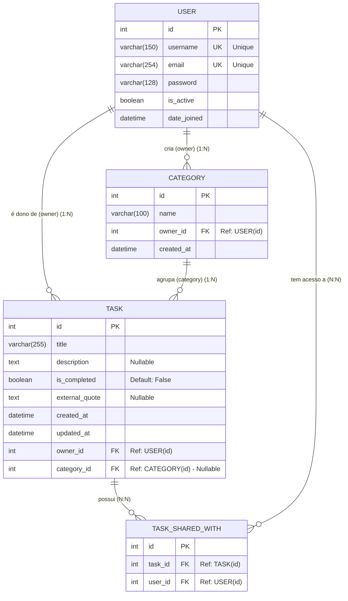

# To-Do List API (Collaborative Task Manager)

Uma API RESTful robusta e segura construída com Django REST Framework (DRF) para gerenciamento colaborativo de tarefas. Este projeto foi desenvolvido com foco em boas práticas de engenharia de software (SOLID, DRY, KISS), segurança de dados e alta cobertura de testes.

## Tecnologias Utilizadas

* **Linguagem:** Python 3.12+
* **Framework:** Django 5+ & Django REST Framework (DRF)
* **Banco de Dados:** PostgreSQL
* **Autenticação:** JSON Web Tokens (JWT) via `djangorestframework-simplejwt`
* **Testes:** Pytest & `pytest-django` com `unittest.mock`
* **Infraestrutura:** Docker & Docker Compose
* **Integração Externa:** ZenQuotes API (Citações motivacionais)

---

## Documentação Interativa (Swagger UI)

A documentação detalhada de todos os endpoints, DTOs (payloads de entrada e saída), filtros disponíveis e métodos HTTP é gerada dinamicamente.

Com a API rodando localmente, acesse:
* **Swagger UI:** [http://localhost:8000/api/docs/swagger/](http://localhost:8000/api/docs/swagger/)
* **ReDoc:** [http://localhost:8000/api/docs/redoc/](http://localhost:8000/api/docs/redoc/)

> 💡 **Observação:** Você pode testar a API diretamente pelo Swagger. Crie uma conta na rota de `register`, faça o `login` para obter o seu token de acesso, clique no botão verde **"Authorize"** no topo da página e cole o token para desbloquear os endpoints protegidos.

---

## Arquitetura e Modelagem de Dados (Models)

O banco de dados relacional foi estruturado para garantir o isolamento de dados entre usuários e permitir o compartilhamento seguro de tarefas.

| Modelo | Campos Principais | Relacionamentos & Regras |
| :--- | :--- | :--- |
| **User** | `username`, `email`, `password` | Modelo padrão do Django. Senhas salvas via hash PBKDF2. |
| **Category** | `id`, `name`, `owner` | `owner` (FK -> User). Usuários só veem suas próprias categorias. |
| **Task** | `id`, `title`, `description`, `is_completed`, `created_at`, `external_quote` | `owner` (FK -> User), `category` (FK -> Category), `shared_with` (M2M -> User). |

**Regras de Negócio Destacadas:**
* **Privacidade:** A listagem pública de usuários omite o campo `email` e, obviamente, o `password`.
* **Segurança:** A API bloqueia a deleção/edição de usuários por terceiros. Apenas o próprio usuário pode editar seu perfil via `/users/me/`.
* **Integração Externa:** Ao concluir uma tarefa (`is_completed=True` via `/change_status/`), a API consome o *ZenQuotes* para atrelar uma citação motivacional à tarefa.

---

## Como Executar o Projeto Localmente

**1. Suba os containers em background:**
```bash
docker-compose up -d --build
```

A API estará disponível em `http://localhost:8000`.

**2. Criar e aplicar migrações do banco de dados (se for a primeira vez):**

```bash
docker-compose exec backend python manage.py makemigrations
docker-compose exec backend python manage.py migrate
```

## Testes Automatizados

Os testes foram escritos utilizando `pytest` e cobre fluxos de sucesso e falha (vulnerabilidades comuns), validação de regras de negócio, isolamento de inquilinos (tenant isolation) e integração via Mocks (simulação da API externa de citações).

**Estrutura de Testes (`backend/tests`/):**

- `test_auth.py`: Validação de senhas fortes, login e geração de tokens.
- `test_users.py`: Privacidade de listagem e controle do endpoint /me/.
- `test_categories.py`: CRUD e isolamento de acesso entre usuários.
- `test_tasks.py`: CRUD, compartilhamento dinâmico, filtros e chamadas externas (Mock API).

**Comando para executar os testes:**

```bash
docker-compose run --rm backend pytest
```

## Estrutura do Banco de Dados (ERD)

