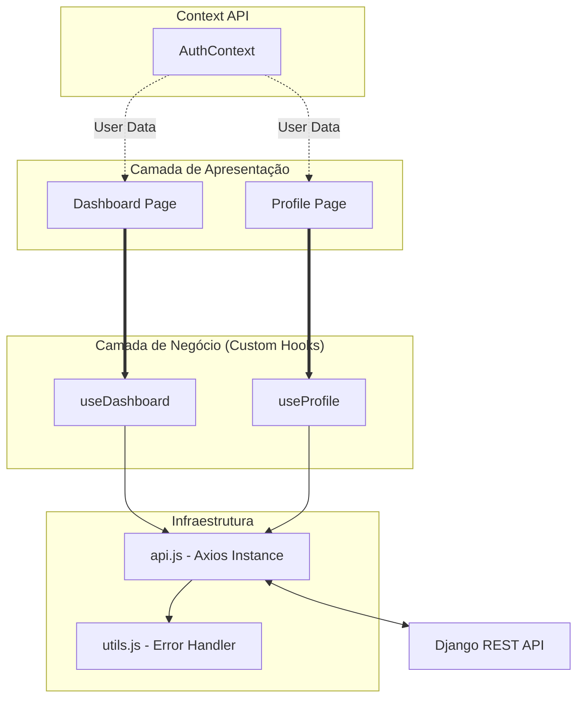
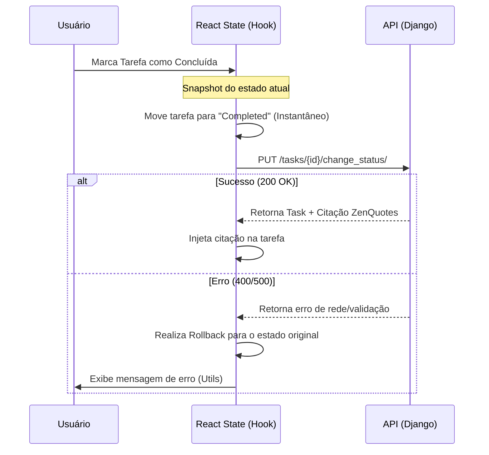

# Collaborative To-Do App (Front-end)

Uma aplicação moderna de gerenciamento de tarefas com foco em performance, colaboração em tempo real e uma experiência de usuário (UX) fluida. Este projeto foi construído para demonstrar padrões avançados de React, como **Custom Hooks**, **Optimistic UI** e separação rigorosa de interesses (SoC).

---

## Funcionalidades Principais

-   **Gestão de Tarefas & Categorias:** CRUD completo de tarefas vinculadas a categorias personalizadas.
-   **Colaboração Real:** Compartilhamento de tarefas entre usuários com níveis de permissão (Dono vs. Convidado).
-   **Interface Reativa (Optimistic UI):** As ações de "concluir" e "deletar" refletem instantaneamente na interface, lidando com a latência da API em background.
-   **Busca & Filtros Avançados:** Filtros por título e categoria integrados à paginação do servidor.
-   **Paginação Independente:** Listas de tarefas pendentes e concluídas paginadas separadamente para melhor organização visual.
-   **Perfil do Usuário:** Edição de dados cadastrais e alteração de senha com validação de segurança.
-   **Autenticação JWT:** Fluxo completo de login, registro e proteção de rotas.

---

## Tecnologias Utilizadas

-   **React.js** (Vite)
-   **Tailwind CSS** (Estilização baseada em utilitários)
-   **Axios** (Comunicação com API e interceptors para Token)
-   **React Router Dom** (Navegação SPA)
-   **Context API** (Gestão de estado global de autenticação)

---

## Arquitetura e Padrões

O projeto segue princípios de **Clean Code** e **Arquitetura Modular**:

-   **Custom Hooks:** Toda a lógica de negócio e chamadas de API foram extraídas das pages para hooks personalizados, facilitando a manutenção e testes.
-   **Componentização:** Divisão lógica entre componentes de layout (Navbar), componentes de dados (TaskItem) e componentes de ação (Modals).

---

## Decisões de Engenharia:

- **Self-Healing Pagination**: Ao usar Optimistic UI com paginação, as listas podem ficar com "buracos" quando um item é movido. Implementei um sistema de Silent Re-fetch que, após o sucesso da API, recarrega as páginas em background para garantir a consistência dos dados sem interromper o fluxo do usuário.
- **Permissionamento Lado-a-Lado**: O sistema identifica dinamicamente se o usuário logado é o owner ou um collaborator. Isso dita não apenas a visibilidade de botões (Share/Delete), mas também bloqueia a edição de campos sensíveis (como Categorias) que pertencem ao tenant do dono.
- **Centralized Error Handling**: Criei um utilitário capaz de parsear os erros complexos do Django Rest Framework (objetos de arrays) em mensagens amigáveis de linha única, garantindo que o usuário sempre saiba o que deu errado.

## Como Executar o Projeto

### Pré-requisitos
- Node.js (v24+)
- NPM ou Yarn
- **Backend rodando:** Certifique-se de que o backend em Django está ativo.

### Instalação

1. Instale as dependências:
```bash
npm install
```
 
2. Configure as variáveis de ambiente:
Crie um arquivo `.env` na raiz do projeto:
```Snippet de código
VITE_API_URL=http://localhost:8000/api/v1
```

3. Inicie o servidor de desenvolvimento:
```bash
npm run dev
```

## Testes Automatizados E2E (Selenium)

A aplicação possui uma suíte completa de testes End-to-End (E2E) escritos em JavaScript utilizando o `Selenium WebDriver` e `Jest`. Esses testes simulam o comportamento de um usuário real navegando na interface, interagindo com o DOM e validando as regras de negócio.

### Pré-requisitos para execução:

Para que os testes funcionem corretamente, o seu ambiente local precisa estar ativo. Certifique-se de que:

1. O **Google Chrome** está instalado na máquina (o WebDriver utilizado nos testes é o ChromeDriver).
2. O servidor **Backend (Django)** está rodando (geralmente em `http://127.0.0.1:8000`).
3. O servidor **Frontend (Vite/React)** está rodando na porta padrão **5173** (`http://localhost:5173`).
4. As dependências do frontend estão instaladas (`npm install`).

**Estrutura de Testes (`frontend/tests`/):**

- `auth.test.js`: Validação de bloqueio de credenciais inválidas, registro de novo usuário e login.
- `categories.test.js`: Validação do fluxo de Categorias (Criação, Edição e Exclusão via modal).
- `profile.test.js`: Validação de alteração de dados cadastrais, atualização de senha e exclusão da conta (Danger Zone).
- `search.test.js`: Validação da funcionalidade de busca por texto e aplicação do filtro de categorias no Dashboard.
- `tasks.test.js`: Validação do ciclo completo de uma Tarefa (Criação com descrição e categoria, Edição, Alteração de status e Compartilhamento).

**Nota de Arquitetura**: Os testes são autossuficientes. Eles geram dados dinâmicos (com timestamps) para evitar conflitos, executam as validações e, ao final de cada suíte, **apagam os dados criados**, mantendo o banco de dados limpo após a execução.

**Comando para executar os testes:**

Abra um novo terminal na pasta do frontend e utilize os comandos abaixo:

**Para rodar a suíte completa (todos os arquivos em sequência):**

Precisa ter rodado o `npm install`.

```bash
npm test -- --runInBand
```

*(A flag --runInBand garante que o Jest execute um arquivo por vez, evitando que múltiplas instâncias do Chrome abram simultaneamente e sobrecarreguem a memória).*

**Para rodar um arquivo de teste específico:**

```bash
npm test -- tests/nome-do-arquivo.test.js
```

## Estrutura de Pastas

```Plaintext
src/
 ├── components/    # Componentes visuais reutilizáveis (Modals, TaskItem, Navbar)
 ├── contexts/      # Contextos (AuthContext para login/sessão)
 ├── hooks/         # Custom Hooks (Toda a lógica de negócio está aqui)
 ├── pages/         # Páginas principais (Dashboard, Profile, Login, Register)
 ├── services/      # Configuração do Axios e chamadas base
 └── utils/         # Funções auxiliares e formatadores
```

## Diagramas:

### Diagrama de Hierarquia e Fluxo de Dados



### Fluxo de Atualização Otimista


